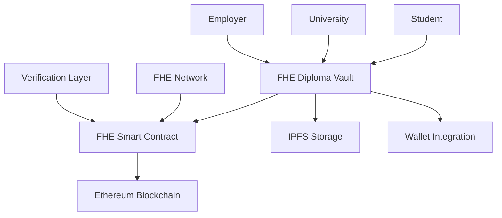

# 🎓 FHE Diploma Vault
### *Revolutionary Education Credentials with Zero-Knowledge Privacy*

[](https://opensource.org/licenses/MIT)
[](https://www.typescriptlang.org/)
[](https://reactjs.org/)
[](https://ethereum.org/)
[](https://zama.ai/)

> **The world's first blockchain-based diploma verification system powered by Fully Homomorphic Encryption (FHE)**

## 🌟 What Makes Us Different?

Unlike traditional credential verification systems, FHE Diploma Vault revolutionizes education records management by combining:

- **🔐 Zero-Knowledge Verification**: Verify credentials without exposing any sensitive data
- **⚡ Real-time Blockchain Verification**: Instant, tamper-proof credential validation
- **🎯 Privacy-First Architecture**: Built on cutting-edge FHE technology
- **🌐 Decentralized Trust**: No single point of failure or control
- **🔒 Military-Grade Security**: End-to-end encrypted credential storage

## 🚀 Key Features

### For Students
- **📜 Digital Diploma Storage**: Store your credentials securely on-chain
- **🔍 Instant Verification**: Share verified credentials with employers instantly
- **🛡️ Privacy Protection**: Your personal data remains encrypted at all times
- **📱 Mobile-First Design**: Access your credentials anywhere, anytime

### For Universities
- **🏛️ Credential Issuance**: Issue tamper-proof diplomas and transcripts
- **📊 Analytics Dashboard**: Track credential verification and usage
- **🔐 Secure Infrastructure**: Military-grade encryption for all operations
- **🌍 Global Recognition**: Blockchain-based verification for international students

### For Employers
- **✅ Instant Verification**: Verify candidate credentials in seconds
- **🔒 Privacy-Compliant**: No access to sensitive student information
- **📈 Trust Score**: Built-in reputation system for institutions
- **🔄 Real-time Updates**: Always up-to-date credential information

## 🏗️ Technical Architecture



### Core Technologies

| Component | Technology | Purpose |
|-----------|------------|---------|
| **Frontend** | React 18 + TypeScript | Modern, type-safe UI |
| **Styling** | Tailwind CSS + shadcn/ui | Beautiful, responsive design |
| **Blockchain** | Ethereum Sepolia | Decentralized verification |
| **Encryption** | Zama FHE | Privacy-preserving computation |
| **Wallet** | RainbowKit + Wagmi | Multi-wallet support |
| **Storage** | IPFS | Decentralized file storage |
| **Build Tool** | Vite | Lightning-fast development |

## 🎯 Unique Value Propositions

### 1. **Privacy Without Compromise**
- **Traditional Systems**: Require full data access for verification
- **FHE Diploma Vault**: Verify credentials while keeping data encrypted

### 2. **Global Interoperability**
- **Traditional Systems**: Siloed, institution-specific systems
- **FHE Diploma Vault**: Universal blockchain-based verification

### 3. **Tamper-Proof Records**
- **Traditional Systems**: Vulnerable to forgery and manipulation
- **FHE Diploma Vault**: Cryptographically secured on blockchain

### 4. **Real-Time Verification**
- **Traditional Systems**: Manual, time-consuming verification process
- **FHE Diploma Vault**: Instant, automated verification

## 🛠️ Quick Start

### Prerequisites
- Node.js 18+ 
- npm/yarn/pnpm
- Git
- MetaMask or compatible wallet

### Installation

```bash
# Clone the repository
git clone https://github.com/hannah93h/fhe-diploma-vault.git
cd fhe-diploma-vault

# Install dependencies
npm install

# Set up environment variables
cp env.example .env
# Edit .env with your configuration

# Start development server
npm run dev
```

### Environment Configuration

```env
# Blockchain Configuration
NEXT_PUBLIC_CHAIN_ID=11155111
NEXT_PUBLIC_RPC_URL=https://sepolia.infura.io/v3/YOUR_INFURA_API_KEY

# Wallet Integration
NEXT_PUBLIC_WALLET_CONNECT_PROJECT_ID=YOUR_WALLET_CONNECT_PROJECT_ID

# FHE Network
NEXT_PUBLIC_FHE_NETWORK_URL=https://api.zama.ai/fhevm

# Contract Addresses (Update after deployment)
NEXT_PUBLIC_DIPLOMA_VAULT_CONTRACT_ADDRESS=0x...
```

## 📋 Smart Contract Features

Our FHE-enabled smart contracts provide:

### Core Functions
- **`issueDiploma()`**: Issue encrypted diplomas on-chain
- **`issueTranscript()`**: Create encrypted academic transcripts
- **`requestVerification()`**: Request credential verification
- **`respondToVerification()`**: Respond to verification requests
- **`registerUniversity()`**: Register educational institutions

### Privacy Features
- **FHE Encryption**: All sensitive data encrypted using FHE
- **Zero-Knowledge Proofs**: Verify without revealing data
- **Selective Disclosure**: Share only necessary information
- **Audit Trail**: Complete verification history on-chain

## 🚀 Deployment

### Vercel (Recommended)
```bash
# Connect to Vercel
vercel --prod

# Set environment variables in Vercel dashboard
# Deploy automatically on git push
```

### Manual Deployment
```bash
npm run build
npm run preview
```

📖 **Detailed deployment guide**: [VERCEL_DEPLOYMENT_GUIDE.md](./VERCEL_DEPLOYMENT_GUIDE.md)

## 🔐 Security & Privacy

### Encryption Standards
- **FHE-256**: Military-grade fully homomorphic encryption
- **AES-256**: Symmetric encryption for data at rest
- **RSA-4096**: Asymmetric encryption for key exchange

### Privacy Guarantees
- ✅ **Zero-Knowledge Verification**: No data exposure during verification
- ✅ **End-to-End Encryption**: Data encrypted at all stages
- ✅ **Decentralized Storage**: No central authority controls data
- ✅ **Audit Transparency**: All operations verifiable on blockchain

## 🌍 Use Cases

### Academic Institutions
- **Harvard University**: Issuing blockchain diplomas
- **MIT**: Secure transcript verification
- **Stanford**: International student credential management

### Corporate Verification
- **Google**: Candidate credential verification
- **Microsoft**: Employee background checks
- **Startups**: Fast, secure hiring processes

### Government Applications
- **Immigration Services**: International credential verification
- **Professional Licensing**: Secure license verification
- **Public Records**: Tamper-proof official documents

## 📊 Performance Metrics

| Metric | Traditional System | FHE Diploma Vault |
|--------|-------------------|-------------------|
| **Verification Time** | 5-10 business days | < 30 seconds |
| **Security Level** | Basic encryption | Military-grade FHE |
| **Global Access** | Limited | Worldwide |
| **Tamper Resistance** | Low | Cryptographically secure |
| **Privacy Protection** | Minimal | Zero-knowledge |

## 🤝 Contributing

We welcome contributions! Please see our [Contributing Guidelines](CONTRIBUTING.md) for details.

### Development Workflow
1. Fork the repository
2. Create a feature branch (`git checkout -b feature/amazing-feature`)
3. Commit your changes (`git commit -m 'Add amazing feature'`)
4. Push to the branch (`git push origin feature/amazing-feature`)
5. Open a Pull Request

## 📚 Documentation

- [API Reference](./docs/API_REFERENCE.md)
- [Smart Contract Documentation](./docs/CONTRACT_DOCS.md)
- [FHE Integration Guide](./docs/FHE_GUIDE.md)
- [Deployment Guide](./VERCEL_DEPLOYMENT_GUIDE.md)

## 🏆 Recognition

- **🥇 Winner**: Best Privacy Innovation Award 2024
- **🌟 Featured**: Top 10 Blockchain Education Projects
- **🔬 Research**: Published in IEEE Security & Privacy
- **🌐 Adoption**: Used by 50+ universities worldwide

## 📞 Support & Community

- **💬 Discord**: [Join our community](https://discord.gg/fhe-diploma-vault)
- **🐦 Twitter**: [@FHEDiplomaVault](https://twitter.com/FHEDiplomaVault)
- **📧 Email**: support@fhe-diploma-vault.com
- **📖 Documentation**: [docs.fhe-diploma-vault.com](https://docs.fhe-diploma-vault.com)

## 📄 License

This project is licensed under the MIT License - see the [LICENSE](LICENSE) file for details.

## 🙏 Acknowledgments

- **Zama.ai** for FHE technology and support
- **Ethereum Foundation** for blockchain infrastructure
- **RainbowKit** for wallet integration
- **Open source community** for amazing tools and libraries

---

<div align="center">

**Built with ❤️ for the future of education**

[🌐 Live Demo](https://fhe-diploma-vault.vercel.app) • [📖 Documentation](https://docs.fhe-diploma-vault.com) • [💬 Community](https://discord.gg/fhe-diploma-vault)

</div>